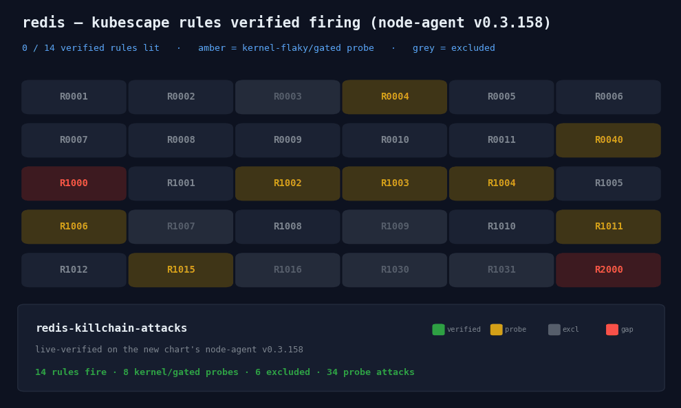
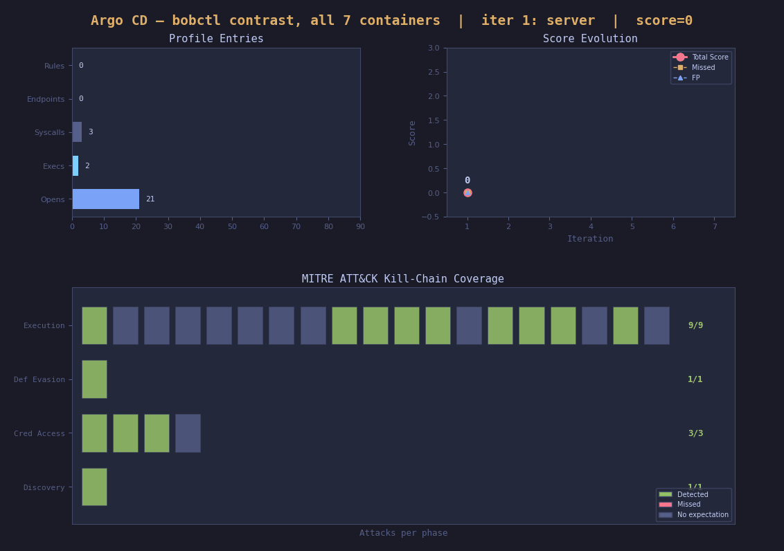

# Software Bill of Behavior SBOB 
Imagine a software vendor (like a pharmaceutical company) distills all their knowledge of their own testing into a standard file and ships it `with each update` . Just like a Container Package-Insert (Packungsbeilage) 📦📃🩻


An SBOB is a profile that provides contrast between intended benign and malicious runtime behaviors. It can be signed, bundled

It's understood to be an abstraction of linux kernel level behavior to express `intent` across systems:

- **to explicitely test for false-negatives**: each attack type can be verified as 'blind' or 'detectable'
- **for continuous anomaly detection at runtime**: allows end-users to calibrate their Detection/Reponse 

  


We foresee a massive scale benefit for the end-user, who does not have in-depth knowledge of the software by shifting authoring and maintaining custom security policies to the vendor, who knows their own software, has the test cases and can judge what part of the policies should be generalized.

**Trademark:** Bill of Behavior is a registered trademark by Constanze Roedig, all rights reserved  


## Example 

SBOB contrast is produced by application type. Redis is an example of `db`




```bash
bobctl contrast --profile example/redis-client/sbobs/ap-redis.yaml --type database --expect reads-host-files --strict
```


🚨GOAL for 2027: 90 percent of all CNCF projects (that run on linux-k8s) get an SBOB 

### Stay informed when more applications get SBOBs or Contribute
Follow us on [Linkedin](https://www.linkedin.com/in/croedig/), or talk to us on [K8sstormcenter slack](https://join.slack.com/t/k8sstorm/signup) 

Next up release: Argo CD with all of its seven components:




### Format/Spec
[Specification](https://billofbehavior.com/bob/docs/spec/) for the [Kubescape reference implementation](https://kubescape.io/docs/operator/bill-of-behavior/).


## TLDR — run bobctl (redis)

```bash
curl -fsSL -o bobctl https://github.com/k8sstormcenter/bob/releases/download/v0.1.2/bobctl-linux-amd64
chmod +x bobctl && sudo mv bobctl /usr/local/bin/


make kubescape
make alertmanager


kubectl apply -f example/redis-client/sbobs/
kubectl apply -f example/redis-client/redis.yaml
kubectl apply -f example/redis-client/client.yaml


bobctl attack --attack-suite example/redis-attacks.yaml -n redis-demo --service redis --service-port 6379 --format table

kubectl logs -n honey -l app=node-agent -c node-agent
```


