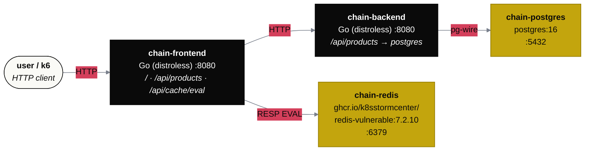
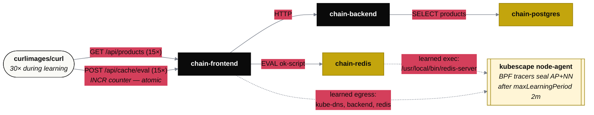
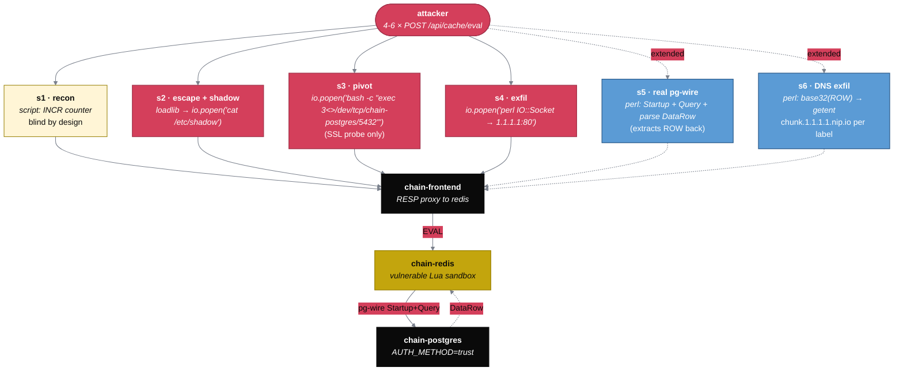
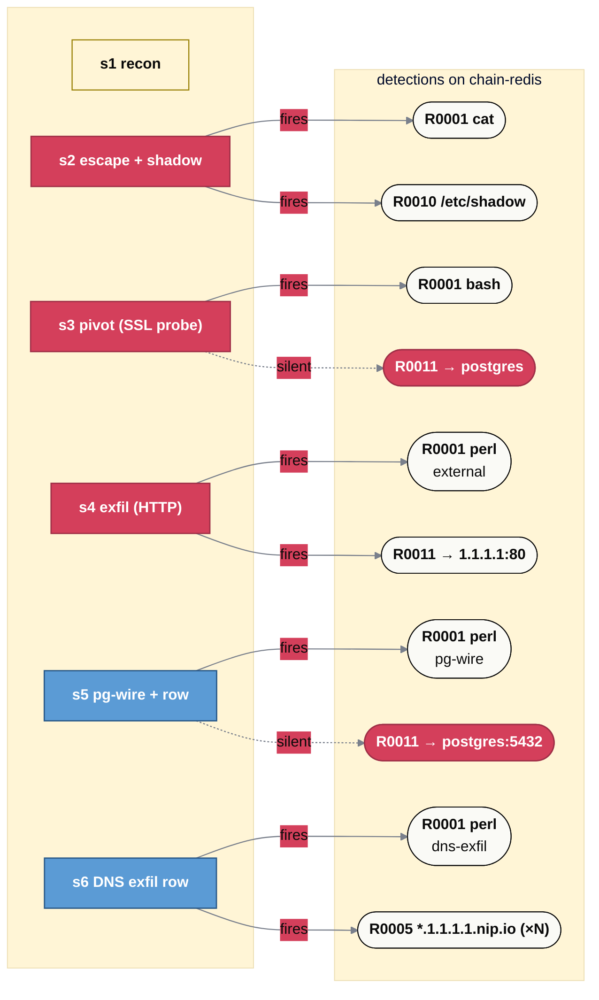
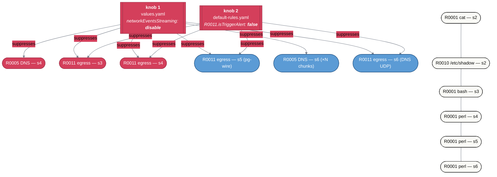
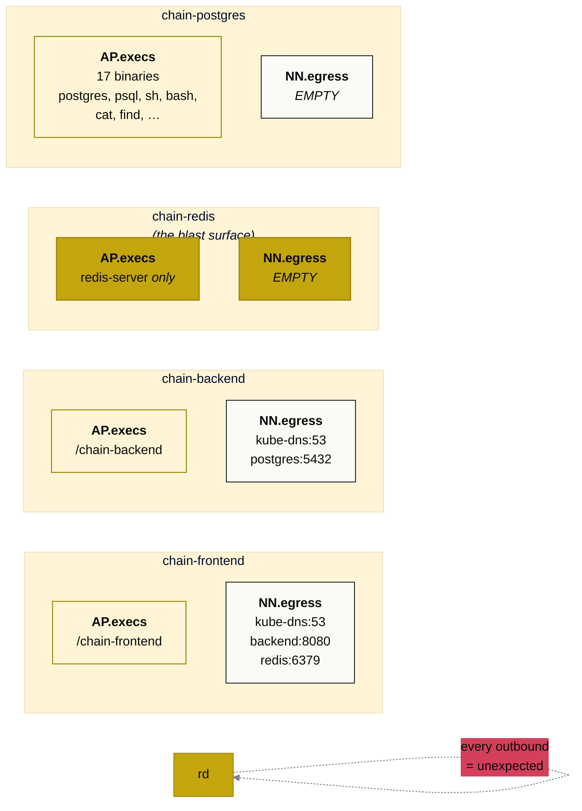
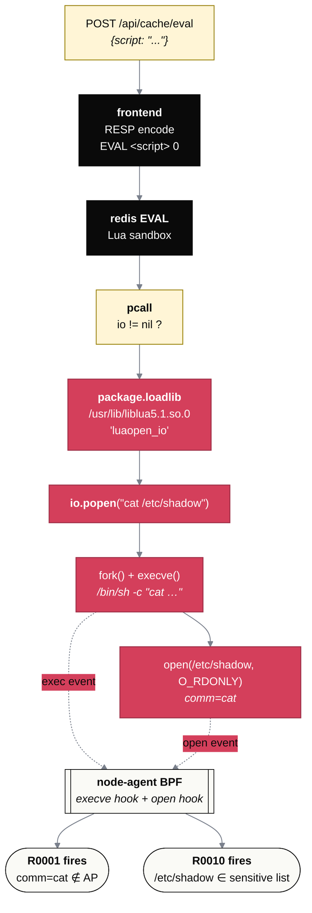
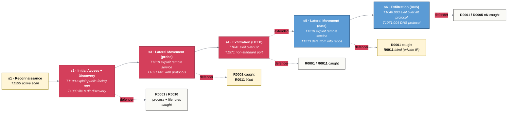
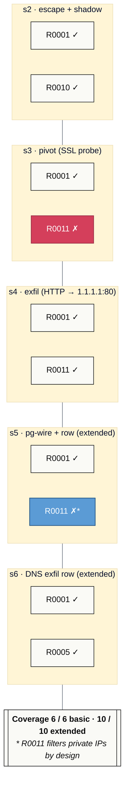
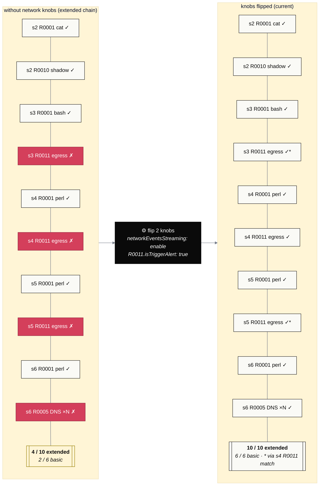

# Chain demo — mermaid variants

Ten diagrams showing different aspects of the chain demo. Style mirrors
the fusioncore-web sbob spec (theme `base` + the 5 semantic classDef
classes `ref` / `live` / `cmp` / `warn` / `ok` with slate link
defaults). Each variant is independent — pick whichever telling fits
the audience.

The shared palette:

```text
ref   gold       #C3A50D  reference / expected / signed
live  black      #0a0a0a  live / runtime
cmp   cream      #fff5d6  comparison / decision / data flow
warn  red        #D43F5B  attack / breach / failure
ok    off-white  #fafaf6  pass / detected / safe
```

---

## 1 · Topology — what's deployed in the `chain` namespace

The four pods and the legitimate service edges. Use this when introducing
the demo to someone who hasn't seen it before.



---

## 2 · Benign-traffic flow — what kubescape learns into the sbobs

The traffic generator's two patterns during the learning window. This
is what defines the legitimate baseline that the chain attack later
silently piggybacks on.



---

## 3 · The attack chain — one POST per stage, all to the eval endpoint

Single attacker, six sequential HTTP POSTs into the SAME legitimate
endpoint. The variant is the Lua **payload**, not the entry vector.
Stages 5 + 6 are opt-in (`./scripts/local-ci-chain.sh --extended`);
stages 1-4 are the default basic chain.



---

## 4 · Where each detection fires (or doesn't)

All 6 stages, but the focus is now WHICH RULE on WHICH POD. Green = fires,
red = silent. Blue stages (s5, s6) are opt-in via `--extended`.



---

## 5 · The blind-spot map — what two cluster knobs would unblind

Each red detection traces back to one of two operator settings. Flip
both → basic demo goes from 4/7 to 7/7, extended from 6/12 to 12/12.



---

## 6 · Sbob contents per pod — why redis is the perfect catch surface

The narrow learned profile on chain-redis (one exec, zero egress) is
the precondition that makes 4 of 7 (basic) / 6 of 12 (extended)
detections trigger reliably. Every comm the attack spawns (cat, bash,
perl × stages) is novel to the AP → R0001; every outbound destination
(postgres:5432 internal, 1.1.1.1:80 external, `*.1.1.1.1.nip.io` for
chunk lookups) is novel to the NN → R0011 fires on the external leg
(s4), R0005 fires on each DNS chunk (s6). The internal-pivot R0011
expectations (s3, s5) remain BLIND-by-design because R0011's
expression filters private IPs.



---

## 7 · Inside the sandbox escape — what the Lua actually does

Zoom into stage 2's payload. Each step is a real Lua + libc call,
mapping to a syscall the BPF tracer can observe.



---

## 8 · MITRE ATT&CK mapping — kill chain across all 6 stages

Same chain, told in TTP language. Each stage maps to one or two MITRE
techniques and a defensive control. Blue stages (s5, s6) are opt-in
via `--extended`.



---

## 9 · Coverage matrix — scenarios × rules

Compact grid view of which expected detection landed where. Same data
as the coverage table the script prints; visual form for slide decks.
Blue rows (s5, s6) are opt-in via `--extended`.



---

## 10 · Knob-flip impact — same demo, two configurations

Side by side: today's defaults vs both knobs flipped. The argument for
paying for network-sbob is that the right column ALREADY exists in
code — it's just gated behind two operator settings.



---

## How to render

These are GitHub-flavoured mermaid blocks — they render natively in
the README on GitHub or in any Hugo build with the
`render-codeblock-mermaid.html` partial that fusioncore-web ships. For
local PNG / SVG export:

```bash
npm i -g @mermaid-js/mermaid-cli
mmdc -i diagrams.md -o chain-diagrams.png --theme base --width 1600
```

For the fusioncore site, drop one of the blocks into a Hugo page; it
will inherit the same palette automatically (the `themeVariables`
header is redundant there but keeps the file portable to GitHub
rendering).
