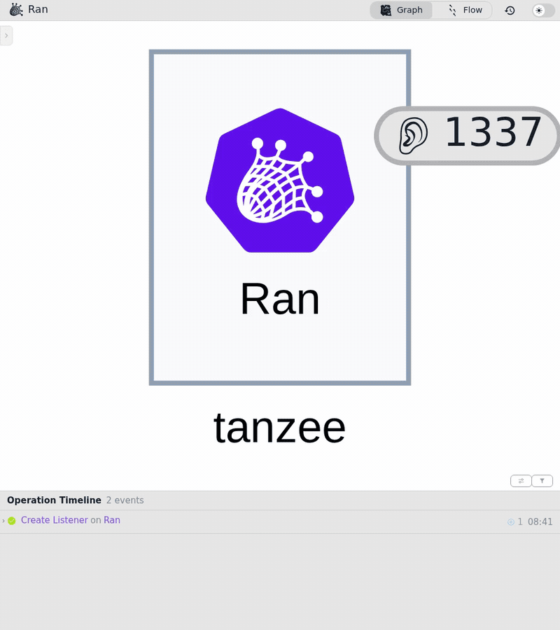

# IKT-Linz — agentic-platform attack chain, automated end to end

An agent-worker platform (`agent-system`) and an intentionally insecure
observability stack (`oopservability`) under a full attack chain, driven
unattended: initial access through to node compromise, with clean SBoBs for
every component so the malignant path is separable from normal operation.



## The chain

1. reverse-shell listener; a worker pod is induced to `socat` back — initial foothold
2. read the mounted ServiceAccount token, drop `kubectl` — the token turns out to hold nothing useful
3. install `nmap`, learn the local IP, sweep the pod subnet
4. **CVE-2022-0543** — Redis Lua sandbox escape gives command execution inside redis
5. **CVE-2026-47701** — a ServiceMonitor with an unsafe `bearerTokenFile` makes the
   injected OTel sidecar leak *its own* token to redis's metric-receiver, which parks
   it in a Redis key; the RCE reads it back. That token belongs to `agent-orchestrator`
   and can create Pods.
6. create an attacker-controlled privileged Pod (hostPath `/`, hostPID) that calls back
7. `nsenter` into the host namespaces, read the k3s cluster credentials

Step-by-step, matching the workshop: [`DEMO-SCRIPT.md`](DEMO-SCRIPT.md).

## Running it

Needs a cluster, and Ran (`ran emulate`) reachable — default `http://localhost:8080`.

Ran must run as a **container**: step results are read back with `docker logs`,
because the API does not expose them. Override the name with `RAN_CONTAINER` if
it is not `ran-ui`, and the endpoint with `RAN_URL`. `relearn-sbobs.sh` also
needs `bobctl`, and the recording scripts need `ffmpeg`, both on `PATH`.

```
./run-iktlinz-e2e.sh                 # deploy platform, benign baseline, fire the chain
./run-iktlinz-e2e.sh --benign-only   # baseline with no disease
python3 demo_chain.py --list         # the 20 steps
python3 demo_chain.py --only 13      # one step
```

`run-iktlinz-e2e.sh` writes `window.json`: the window boundaries plus the
specimens that must survive into a filtered forensic store. It deliberately does
not configure a detection stack — that stays with the caller.

## SBoBs

`sbobs/` holds one ContainerProfile per component, learned from a **benign-only**
window and checked for attack markers before shipping. Regenerate with
`./relearn-sbobs.sh`.

Profiles learned *while the chain runs* are worthless as a baseline — redis's
contained the RCE itself (`/bin/sh -c id`) and the worker's contained
apt/nmap/kubectl. Generalising those allowlists the attack, and nothing fires.
Re-learning needs a **new pod identity**: node-agent tombstones the profile name,
so deleting the ContainerProfile is not enough, the workloads must be restarted.

Names are `<user-defined-profile label>-<containerName>`, which is how node-agent
resolves them; ReplicaSet-hash names never bind.

## Recording

`record.cjs` screencasts the UI at half-screen width, `make-gif.sh` reduces a
recording to only its settled frames, `compose-split.sh` stacks two panels.

Two things cost real time when recording headless Chrome:
- it throttles rendering when backgrounded, so a screencast records one frozen
  frame — `record.cjs` disables the throttling and waits for the canvas to settle;
- the graph is drawn on `<canvas>`, so there is no DOM node to await and a fixed
  sleep races the paint, producing blank frames.

## Notes from the field

- The reverse shell is a **single serial pipe** with a 150s per-command budget
  that `executionTimeoutSeconds` does not override. One long command wedges every
  later one. An unbounded `nmap -sT` over a /24 blocks the session for 10+ minutes.
- Scan range matters: measured in-pod with the exact command form, `/27` = 3s,
  `/26` = 142s, `/25` = 91s, `/24` = 176s. It is not monotonic — mostly-empty
  ranges pay discovery retries. The scan derives the smallest range covering both
  the foothold and the target, never coarser than `/25`.
- A pod fronted by two Services gets whichever name reverse-DNS returns, so match
  entities on namespace + substring, never an exact service name.
- CVE-2026-47701 needs its prerequisites or there is nothing to leak: the OTel
  sidecar injected into `agent-orchestrator`, its ConfigMap, and the ServiceMonitor.
  `run-iktlinz-e2e.sh` applies them and warns if the sidecar is missing.

## Credits

Scenario, `ran` emulator, Oopserability and the agent platform by
[@Magier](https://github.com/Magier).
