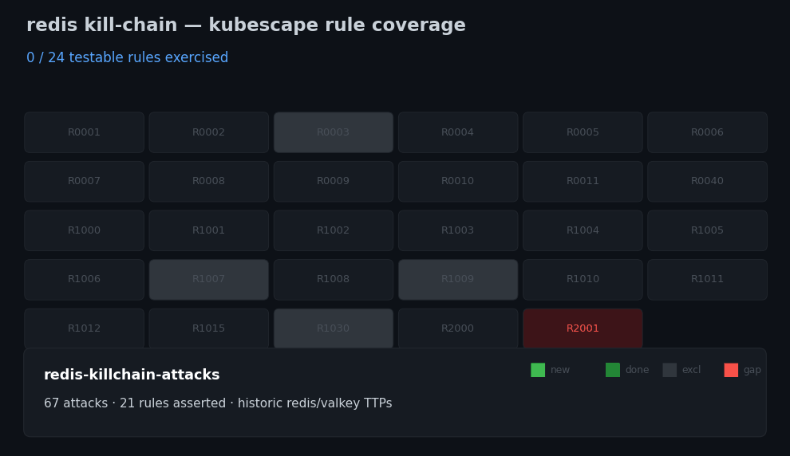

# redis-client — a database SBoB with exactly ONE allowed client

A minimal, substitutable Bill-of-Behavior for redis (the `database` app type),
built to make the **egress/ingress contrast** concrete: a datastore's network
normal is *"declared clients talk IN on the service port; the server talks OUT
to nobody."* Encode that and every rule below becomes maximally separable.



## What's here

| file | role |
|---|---|
| `redis.yaml` | the redis server (namespace `redis-demo`, label `app: redis`) |
| `client.yaml` | the **one allowed client** — a benign SET/GET/PING loop (`app: redis-client`) |
| `sbobs/nn-redis.yaml` | NetworkNeighborhood: **one** ingress peer, `egress: null` |
| `sbobs/ap-redis.yaml` | ApplicationProfile: exact execs, wildcard only volatile paths |

## Deploy

```bash
kubectl apply -f example/redis-client/sbobs/     # SBoBs first (User-managed)
kubectl apply -f example/redis-client/redis.yaml
kubectl apply -f example/redis-client/client.yaml
```

## Substitute your own client (the point)

The redis NN whitelists **one** ingress peer by label selector. To authorize
*your* real client instead of the demo one, edit the `>>> SUBSTITUTE <<<` block
in `sbobs/nn-redis.yaml`:

```yaml
podSelector:
  matchLabels:
    app: redis-client                        # ← your client's pod label
namespaceSelector:
  matchLabels:
    kubernetes.io/metadata.name: redis-demo  # ← your client's namespace
```

Then delete `client.yaml`. Two selectors, one peer — an explicit, auditable
allow-list. More than one legitimate client? Add another `- identifier:` block
per client; each is a named exception a reviewer can see. Anything **not** on
this list that connects to redis is, by construction, an anomaly.

## Why so tight (the generalization principle)

A database's contrast strength comes from a *narrow* envelope:

- **execs exact** — only `redis-server` / `redis-cli`. Wildcarding execs is what
  destroys a DB's detection; a shell or fetched binary must stand out.
- **opens: literal stable paths, wildcard only the volatile** — the ConfigMap
  `..data` generation dir (`/etc/redis/*/redis.conf`, changes every restart) and
  per-PID `/proc/⋯`, per-device `/sys/*`. Nothing else.
- **egress empty** — the server dials nobody, so R0011/R0005 fire on the first
  unexpected packet.

## What a detection MEANS — TTP mapping (database lens)

When one of these kubescape rules fires against this baseline, here is what it
tells the end-user. For the `database` type every rule is **Separable** (the
symptom stands out) — with the one caveat in the last section.

| Rule | ATT&CK | Fires when redis… | What it means for you |
|---|---|---|---|
| R0001 Unexpected process | T1059 | spawns a non-redis process | **RCE** — Lua `io.popen`, module exec, injected command |
| R0040 Unexpected args | T1059 | a known binary runs with new args | living-off-the-land variant of the above |
| R1001 Drifted process | T1554 | runs a binary not in the image | a **dropped/implanted** tool executed |
| R1004 Process from mount | T1059 | execs from a mounted volume | payload delivered via a writable mount |
| R1000 Process from /dev/shm | T1620 | execs from shared memory | staged fileless-style payload |
| R1005 Fileless execution | T1620 | runs code from an anon memfd | **in-memory malware**, nothing on disk |
| R0002 File access anomaly | T1005 | reads/writes outside baseline | data staging / config tamper / reading `/etc/shadow` |
| R0010 Sensitive file access | T1552.001 | reads keys/tokens/secrets | **credential access** |
| R0006 SA-token access | T1552.001 | reads the k8s serviceaccount token | theft to **pivot to the API server** |
| R0008 Env from procfs | T1552 | reads another process' `environ` | secret/cred harvesting |
| R0007 Uses k8s API | T1613 | talks to kube-apiserver | a DB has no reason to — **recon/lateral** |
| R0005 DNS anomaly | T1071 | resolves a new domain | **C2 beacon** or exfil target lookup |
| R0011 Unexpected egress | T1041 | opens ANY outbound connection | **exfiltration / reverse shell** (server egress = 0) |
| R1003 SSH unexpected dest | T1021.004 | initiates SSH | **lateral movement** |
| R1007/8/9 crypto-mine | T1496 | spawns miner / hits pool domain / port | **resource hijack** |
| R0004 Capabilities anomaly | T1611 | uses a new Linux capability | **privilege escalation / escape prep** |
| R1006 unshare | T1611 | creates a new namespace | **container-escape** primitive |
| R0009 eBPF load | T1611 | loads an eBPF program | kernel-level **rootkit/tamper** |
| R1002 Kernel module load | T1547.006 | loads a kmod | **rootkit** |
| R1015 ptrace | T1055.008 | ptraces another process | **code injection / credential dumping** |
| R1030 io_uring | T1620 | uses io_uring | stealthy I/O — **detection evasion** |
| R0003 Syscall anomaly | T1106 | new syscall vs baseline | exploit primitive (broad signal) |
| R1010/R1012 sym/hardlink | T1222 | links over a sensitive file | **persistence / priv-esc** |
| R1011 ld_preload | T1574.006 | sets `LD_PRELOAD` | library-injection **persistence** |
| R2000 Exec to pod | T1609 | someone `kubectl exec`s in | interactive intrusion (or admin — verify) |
| R2001 Port-forward to pod | T1609/T1090 | someone port-forwards in | access **tunnel** to the datastore |

### The honest caveat (why the model isn't finished)

Two known gaps, both provable on this very SBoB:

**(a) `reads-host-files` is over-broad.** Run
`bobctl contrast --profile sbobs/ap-redis.yaml --type database` and it reports a
`reads-host-files` deviation — triggered by the benign `/sys/devices/*` read
(device topology / hugepage settings) that essentially every container performs.
`isHostPath` currently counts `/sys` and `/proc/sys` as host-escape surface,
which makes *every* database falsely deviate. The fix is to narrow it to genuine
breakout paths (`/host*`, `/proc/1/*`, `/proc/sysrq-trigger`) so `/sys/devices`
and `/proc/sys/net` tuning reads stop counting.

**(b) capabilities aren't read yet.** The "all Separable" row assumes the
envelope is truly empty. The **real** redis profile from CI carries `SYS_ADMIN`
+ `NET_ADMIN` in its granted capabilities.
If contrast read capabilities (it does not yet), redis would gain the
`uses-kernel-features` property, and the kernel-family rules — **R0003, R0004,
R0009, R1002, R1006, R1015, R1030** — flip from Separable to **Blind**: a redis
allowed to hold `SYS_ADMIN` cannot be told apart from one abusing it. That is
why `ap-redis.yaml` declares `capabilities: []` **explicitly (NONE)** — the
authored baseline says "this redis needs no added caps," turning R0004 back into
a hard signal. Match that by dropping the caps in your redis Deployment
(`securityContext.capabilities.drop: ["ALL"]`).

---

## Attack coverage — one realistic attack per rule

Added to `example/redis-attacks.yaml` (67 attacks total). Each row is a real,
historically-grounded redis/valkey technique; "Attack" is the entry name in the
suite. Excluded by design: crypto-mining (R1007/R1008/R1009 — R1008 already
covered), io_uring (R1030), raw syscalls (R0003).

| Rule | Attack (redis-attacks.yaml) | Delivery | Historic technique |
|---|---|---|---|
| R0001 exec | `exec-whoami`, `lua-reverse-shell`, … (20) | exec / Lua | shell spawn via Lua `io.popen` (CVE-2022-0543) |
| R0040 args | `recon-redis-cli-bigkeys` | exec | trusted `redis-cli --bigkeys` keyspace recon |
| R1004 proc-from-mount | `exec-from-data-mount` | exec | rogue-master drops `exp.so` in the data volume |
| R1005 fileless | `lua-cve-full-chain` | exploit | CVE-2025-49844 (RediShell) |
| R0002 file anomaly | `rce-rogue-module-write` (BGSAVE) | RESP | unauth `CONFIG SET dir`+`SAVE` RCE (RedisWannaMine/Muhstik) |
| R0010 sensitive file | `exec-etc-shadow`, `escape-host-etc-passwd` | exec | credential-file read |
| R0008 procfs env | `exec-proc-environ` | exec | secret harvest from `/proc/*/environ` |
| R0007 k8s API | `k8s-api-recon` | exec | SA-token → kube-apiserver pivot (TeamTNT) |
| R0005 DNS | `egress-rogue-master-replicaof` | RESP | `REPLICAOF` attacker domain (rogue-master) |
| R0011 egress | `egress-rogue-master-replicaof` | RESP | server dials out — pairs with `egress: null` SBoB |
| R1003 SSH | `lateral-ssh-nonstandard-port` | exec | worm-style lateral movement |
| R1008 mining domain | `exec-crypto-dns` | exec | mining-pool DNS |
| R0004 caps | `escape-mount-cap-sys-admin` | exec | `mount` via CAP_SYS_ADMIN (privileged escape) |
| R1006 unshare | `escape-unshare-namespaces` | exec | CVE-2022-0492 cgroup escape |
| R0009 eBPF | `rootkit-ebpf-load` | exec | BPFDoor / TeamTNT eBPF rootkit |
| R1002 kmod | `rootkit-insmod-lkm` | exec | Diamorphine/Reptile LKM rootkit |
| R1015 ptrace | `inject-ptrace-pid1` | exec | process injection / cred dump |
| R1010 soft-link | `escape-symlink-host-shadow` | exec | symlink over sensitive file |
| R1012 hard-link | `persist-hardlink-shadow` | exec | hardlink persistence / TOCTOU |
| R1011 ld_preload | `persist-ld-preload` | exec | libprocesshider `/etc/ld.so.preload` (TeamTNT) |
| R2000 exec-to-pod | `control-plane-exec-to-pod` | exec | `kubectl exec` with stolen kubeconfig |

**Asserted on `R0001` for CI stability** (specific rule is environmentally flaky
in k3s CI): `exec-sa-token` (R0006), `exec-devshm` (R1000), `exec-drifted`
(R1001). **Not deliverable in-container:** R2001 (port-forward) — needs a
harness-level `kubectl port-forward` step.

---

## How the rules produce contrast (verified live on node-agent v0.3.158)

Contrast = the gap between the tight authored baseline and what an attack does.
For redis, **11 rules were verified firing** against the stock
`redis-vulnerable:7.2.10` image, and each fires *because* the baseline is
narrow:

| Rule | What makes it Separable for redis | Attack that proves it |
|---|---|---|
| R0001 process | baseline execs are `redis-server`/`redis-cli` only | any spawned tool |
| R0002 file anomaly | baseline opens are a fixed, small set | writes/reads off-path |
| R0004 capabilities | baseline uses **no** added caps | mount / bpf / hardlink syscall |
| R0005 DNS | NetworkNeighborhood egress is `null` | REPLICAOF to a resolvable domain |
| R0006 SA-token | redis never reads its token | `cat …/serviceaccount/token` |
| R0007 k8s-API | redis never talks to the apiserver | dropped tool → `$KUBERNETES_SERVICE_HOST:443` |
| R0009 eBPF | redis never calls `bpf()` | `syscall(321,…)` (fires on attempt) |
| R0011 egress | egress `null` ⇒ any outbound is anomalous | REPLICAOF / socket out |
| R1001 drift | every executable is image-native | a copied/dropped binary runs |
| R1002 kmod | redis never loads modules | `init_module` attempt (fires on attempt) |
| R1012 hardlink | redis never links sensitive files | `ln /etc/shadow …` (fires on attempt) |

Two properties do the heavy lifting: **`egress: null`** turns the whole network
dimension Separable (R0005/R0011/R0007), and **`capabilities: []`** turns the
kernel dimension Separable (R0004 — and, on an unconfined pod, R0009/R1002/R1015).
Both are things you *author*, not learn.

## Minimizing false positives

The same tight baseline is what keeps FPs near zero — the risk is under-, not
over-specifying. The rules of thumb this example bakes in:

1. **Wildcard only the genuinely volatile paths, nothing else.** The one moving
   part in redis's opens is the ConfigMap `..data` generation dir, collapsed to
   `/etc/redis/*/redis.conf`; per-PID `/proc/⋯` and per-device `/sys/*` are
   collapsed by storage. Everything else stays literal. Over-wildcarding execs
   or opens is the #1 FP *and* detection-killer — never do it to silence a rule.
2. **Prefer NONE (`[]`) over absent for caps/endpoints.** An explicit empty list
   says "this is the whole envelope" and keeps R0004 a hard signal; an *absent*
   field is treated as "unconstrained" and silently widens the envelope.
3. **Author egress as the exact client set.** One ingress peer, `egress: null`.
   Any drift (a new client, any outbound) is a true positive by construction —
   substitute your real client's selector rather than broadening.
4. **Regenerate per image/version.** Shared-object paths differ across
   libc/distro; a baseline learned for one image FPs on another. Re-`learn`
   when you change the image, don't paper over it with wildcards.
5. **Bounce the workload pod to relearn** (not the node-agent), and drive load
   over the network so the *server* exec baseline stays clean — a baseline
   polluted with `kubectl exec`'d tools masks the very execs you want to catch.

The honest boundary: rules needing a tool/cap/technique the stock image lacks
(R1003 ssh, R1004 mount volume, R1006 escape, R1011 ld_preload, R1015 ptrace,
R0040 learned-profile args, R2000/R2001 control-plane) are documented probes,
not asserted — they light up only on a privileged+tooled redis variant.
